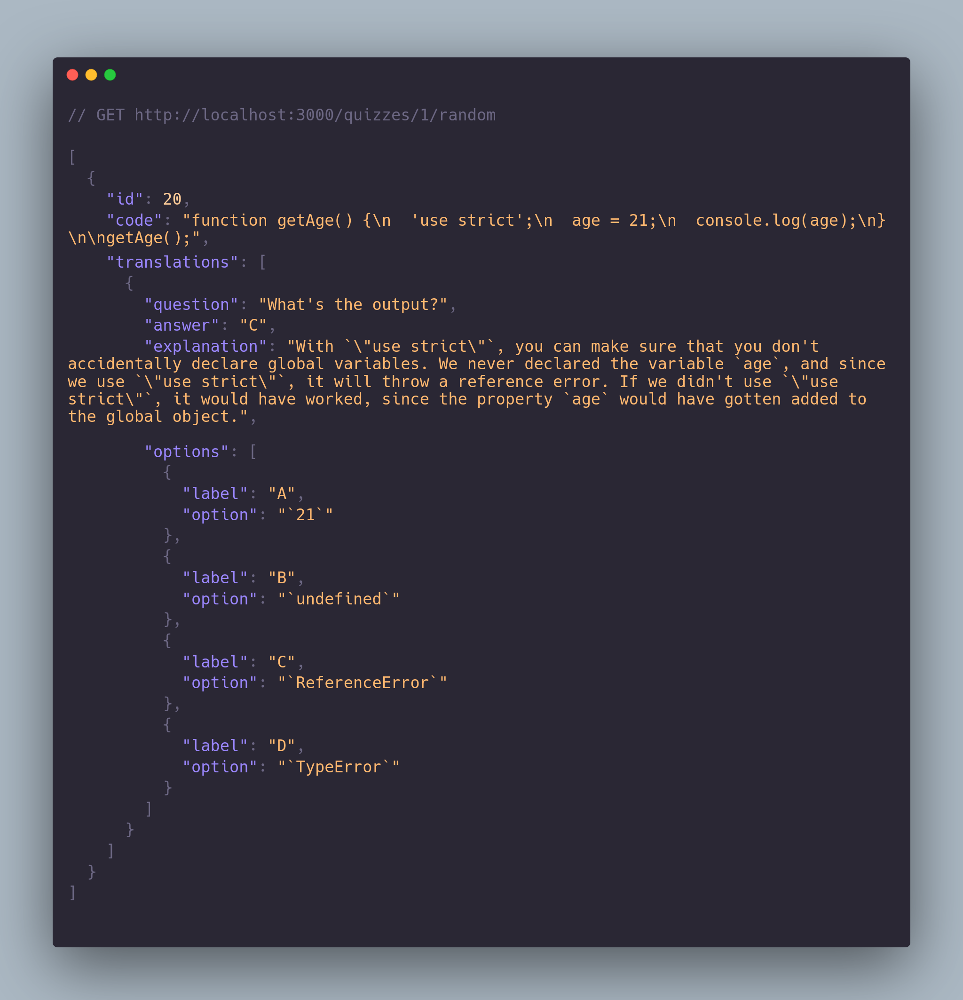

<br />
<div align="center">
  <div align="center">
    
  </div>

  <br />
  <h1 align="center">JavaScript Questions API</h1>

  <p align="center">
    <a href="https://javascript-questions-api.herokuapp.com/docs/">Live Demo</a>
  </p>

  
</div>

- [Description](#description)
- [Getting started](#getting-started)
  - [Install with docker-compose](#install-with-docker-compose)
  - [Manual installation](#manual-installation)
- [Resources](#resources)
- [License](#license)

## Description

Unofficial API of [javascript-questions](https://github.com/lydiahallie/javascript-questions), made with ❤️

## Getting started

### Install with docker-compose

1. Create .env file (see .env.example)

2. Run the following commands:

```bash
docker-compose build
docker-compose up

docker exec -it nest-api npm run db:migrate
docker exec -it nest-api npm run db:seed
```

### Manual installation

1. Clone this repo
2. Run `pnpm install` or `npm install` or `yarn` to install dependencies

```bash
$ pnpm install
# or
$ npm install
```

3. Prepare a postgres database, or create a new one with docker-compose

```bash
$ docker-compose -f docker-compose.db.yml up -d
```

4. Migrate and seed the database

```bash
$ pnpm db:migrate
$ pnpm db:seed

# or
$ npm run db:migrate
$ npm run db:seed
```

5. Create .env file (see .env.example)

6. Start server

```bash
$ pnpm start:prod
# or
$ npm run start:prod
```

## Resources

[Carbon](https://github.com/carbon-app/carbon)
[JavaScript Logo](https://iconscout.com/icon/javascript-2752148)

## License

[MIT licensed](LICENSE).
